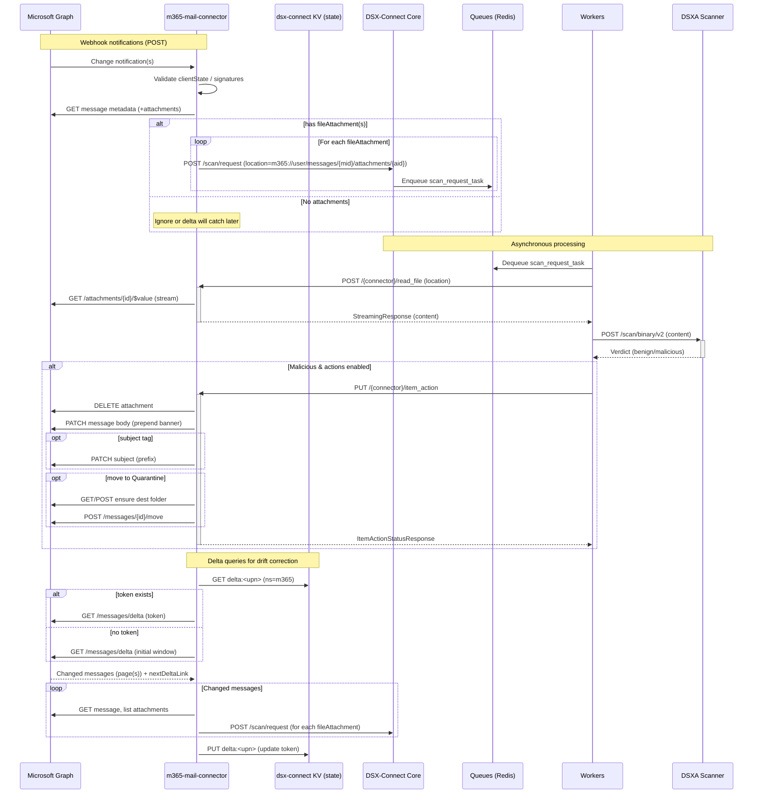

# M365 Email Attachments Connector (Design)

This document describes a new connector, `m365-mail-connector`, that scans Microsoft 365 (Exchange Online) email attachments via Microsoft Graph and integrates with dsx-connect using the Enrollment + per‑connector HMAC model.

## Goals
- Near real‑time scanning of email attachments at scale.
- Safe bootstrap: Enrollment token → provision HMAC; all subsequent traffic signed (both directions).
- Webhook-first with delta-query backup for reliability.
- Optional remediation: move message, delete attachment, or tag on malicious verdicts.

## High‑Level Flow
- Startup
  - Register with dsx-connect (Enrollment header); receive HMAC (`kid`, `secret`); store in memory.
  - Validate Graph credentials by obtaining a token (client credentials flow).
  - Create/renew Graph subscriptions for target mailboxes (e.g., `/users/{id}/messages`), with `includeResourceData=true` when desired.
- Webhook events (Graph → connector `/webhook_event`)
  - Validate notification (validationToken for GET; POST signature/clientState for deliveries).
  - For each change: fetch message metadata; if `hasAttachments=true`, enumerate attachments.
  - For `fileAttachment`: stream `/attachments/{attId}/$value` to dsx-connect scan request.
  - For `itemAttachment`: optional; usually low value; flag via config.
  - For `referenceAttachment`: optional; requires `Files.Read.All` to download from OneDrive/SharePoint; or skip and rely on storage connectors.
- Remediation (optional)
  - Move message (`/messages/{id}/move`) to a quarantine folder.
  - Delete malicious attachment.
  - Tag subject/body or add category.
- Full Scan / Backfill
  - Use delta queries (`/users/{id}/mailFolders('inbox')/messages/delta`) to enumerate new/changed messages and scan attachments.
  - Persist delta tokens per mailbox in dsx-connect’s Connector State KV (`m365/delta:<upn>`) to continue incrementally.
  - Treat “full scan” as a bounded delta pass across every configured asset (mailbox or mailbox/folder). Each pass walks the Graph delta chain, enqueues attachments, then stores the returned `@odata.deltaLink` as the new cursor.
  - A background delta runner executes every `delta_run_interval_seconds` (default 600s) to catch drift and initial loads.
  - Manual command: `POST /dsx-connect/api/v1/connectors/full_scan/{uuid}` triggers a one-shot delta run via `@connector.full_scan`, reusing the same logic and reporting how many attachments were enqueued (honors `?limit=N` for test runs).

## Permissions
- Application permissions (recommended):
  - Minimum read: `Mail.Read` (or `Mail.ReadWrite` if actions are enabled).
  - For `referenceAttachment` download: `Files.Read.All`.
  - For resource data in notifications: cert + `includeResourceData=true` subscriptions.

## Configuration (examples)
- Tenant / App creds: `tenant_id`, `client_id`, `client_secret` or client cert.
- Scope of mailboxes: explicit UPN list, security group, or all users.
- Subscription management: renewal interval, includeResourceData.
- Processing policy: max attachment size, allowed types, referenceAttachments policy.
- Item actions policy: `move`, `delete`, `tag`, `nothing`.

## Assets & Filters (Mailbox Scope)
- **Asset (`DSXCONNECTOR_ASSET`)** sets the precise mailbox or mailbox/folder root — no wildcards.
  - Mailbox-level: `user@contoso.com`
  - Mailbox folder: `user@contoso.com/Inbox`, `user@contoso.com/Finance`
  - Use assets to shard large estates by deploying multiple connector instances (per mailbox or per high-value folder).
- **Filter (`DSXCONNECTOR_FILTER`)** applies rsync-style include/exclude rules to attachment filenames relative to the asset.
  - Examples: `/.zip`, `**/*.docx`, `-tmp/`
  - Pros: expressive for suffix- or path-based selection without changing the asset root.
  - Cons: complex excludes can force broader provider listings, so prefer assets for coarse partitions.
- **Sharding patterns**
  - *Asset-based*: instance A → `user1@contoso.com/Inbox`, B → `user1@contoso.com/Finance`, C → `user2@contoso.com/Inbox`.
  - *Filter-based*: single mailbox asset, multiple instances with include-only filters such as `filter=Inbox/` vs `filter=Finance/`.
  - Combine with DSX scheduler for predictable concurrency and per-mailbox throttling.

## Security
- Enrollment + HMAC per connector for all dsx‑connect ↔ connector private routes.
- Webhook validation & signature checks for Graph notifications.
- OAuth tokens stored in memory only (no on-disk secrets).

## Reliability & Scaling
- Subscription renew loop with jittered backoff.
- Delta queries to catch missed events; idempotent dedupe on (messageId, attachmentId) in Redis.
- Respect Graph 429 / Retry-After.
- Stream downloads to avoid memory pressure; size limits enforced by config.

## Files (scaffold)
- `connectors/m365_mail/config.py`: pydantic config for Graph + connector settings.
- `connectors/m365_mail/start.py`: Typer CLI to launch uvicorn.
- `connectors/m365_mail/m365_mail_connector.py`: DSXConnector wiring; webhook, repo_check stubs.
- `connectors/m365_mail/graph_client.py`: placeholder Graph helpers (auth, fetch attachments) — to be implemented.
- `connectors/m365_mail/subscriptions.py`: placeholder subscription manager — to be implemented.
- `connectors/m365_mail/version.py`.
- `connectors/m365_mail/deploy/helm`: chart (ingress only for `/webhook_event`, HMAC on private routes).
- `connectors/m365_mail/deploy/docker`: compose + deployment guide.

## Initial Constraints / Defaults
- Start with `referenceAttachment: skip` (rely on storage connectors) — can add later.
- Actions disabled by default; enable via config.
- Mailbox scope configurable (start with explicit UPN list for safety).

## Typical Actions (Industry Patterns)
Many mature email security products (e.g., Proofpoint, Microsoft Defender) commonly apply these actions post‑verdict:

- Strip + Banner: Delete the attachment and deliver the message with a banner/placeholder inserted into the body (e.g., “Attachment removed for security review”). Often includes a link or note on how to retrieve from quarantine.
- Subject Tagging: Prepend a tag such as “[Suspicious]” or “[External]” to increase caution and support mail flow rules.
- Quarantine/Move: Move the entire message to a quarantine folder/mailbox for later review or release.
- URL Rewriting/Defang: Common in link protection; out of scope initially for attachments.
- Detonation + Delayed Delivery: Hold message until sandbox verdict returns; or “dynamic delivery”: deliver body immediately and re‑attach if clean.
- Metadata/Headers: Add X‑headers or categories for SOC/SIEM workflows (e.g., “X‑Attachment‑Scan: malicious”).

For v1 of this connector, we propose:
- Default action: Delete attachment + prepend an HTML banner (configurable).
- Optional actions (toggle per policy): Move to Quarantine folder, Subject tagging, Add X‑headers.
- Preserve audit data (message/attachment metadata) in Redis or by moving to an audit mailbox/folder for investigations.

### Banner Template (example)
Configurable banner (HTML) prepended to the message body upon malicious detection. Example:

```
<div style="border:1px solid #f00;background:#fee;padding:12px;margin-bottom:12px;">
  <strong>Security Notice:</strong> An attachment was removed from this email during scanning.
  If you believe this is an error, please contact your security team.
</div>
```

The connector will PATCH the message body to prepend this HTML after deleting the attachment.

## Webhooks vs Gateways
Two common models exist:

- Pre‑delivery (inline SEG/gateway): MX points to a gateway which scans before delivery (Pros: prevention; Cons: infrastructure, mail flow changes).
- Post‑delivery (API‑only): Microsoft Graph change notifications (webhooks) + delta queries (Pros: cloud‑native, simple to deploy; Cons: post‑delivery model, relies on timely API callbacks).

This connector follows the post‑delivery approach:
- Webhook‑first for near real‑time eventing.
- Delta queries for backfill and resiliency (missed notifications, downtime windows).

## Policy Defaults (Proposed)
- `handle_reference_attachments=false`
- `enable_actions=false` (when enabled, default = delete attachment + banner; quarantine and tagging optional)
- `max_attachment_bytes=50MB`
- `mailbox_upns` explicit list required initially (safer). “All users” can be added later.

## Graph API Mapping (Actions)
- Delete attachment: `DELETE /users/{user}/messages/{id}/attachments/{attId}`
- Insert banner: `PATCH /users/{user}/messages/{id}` with updated HTML body (prepend banner + original body)
- Move to Quarantine: `POST /users/{user}/messages/{id}/move` to folder name/path
- Subject tagging: `PATCH /users/{user}/messages/{id}` (subject prepend)
- Categories/Headers: `PATCH /users/{user}/messages/{id}` (categories); custom headers limited via Graph — prefer categories/tags

## Mermaid: Webhooks + Delta + Actions



## Webhook Validation + clientState
- GET validation: Graph sends a verification request with `validationToken` query param. The connector echoes this token as plain text.
- ClientState (optional): configure a shared `clientState` and the connector will verify it on webhook deliveries.

## KV State (Delta Tokens)
- Delta tokens are stored via dsx‑connect’s HMAC‑protected KV endpoints.
- See Operations → [Connector State KV](../operations/kv-state.md) for usage.
