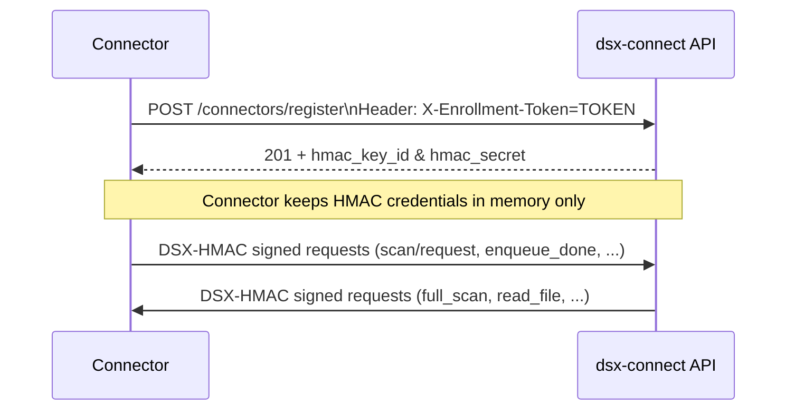

# Authentication

Mandatory authentication keeps every connector and dsx-connect call tied to a registered identity. Once enabled, only connectors that successfully enroll can invoke dsx-connect APIs (including high-impact actions such as `item_action`, `read_file`, or `delete`). Likewise, dsx-connect can no longer invoke a connector’s private endpoints unless the request is DSX-HMAC signed, so ad-hoc `curl`, Swagger UI, or Postman calls against connector routes simply fail.

Use this page as part of the Kubernetes deployment flow (the same mechanisms exist in Docker Compose, but production-grade TLS/auth combos are expected to run via Helm).

## How it works

1. **Bootstrap (Enrollment Token).** You provide dsx-connect with one or more enrollment tokens. A connector can register only if it presents a valid token.
2. **Per-connector HMAC.** During registration, dsx-connect issues a unique `hmac_key_id`/`hmac_secret`, stores it in Redis, and returns it to the connector (never persisted on disk).
3. **Mutual DSX-HMAC.** After bootstrap, every connector ↔ dsx-connect request must include the `Authorization: DSX-HMAC ...` header. This guarantees that dangerous ops such as `item_action` run only against connectors that dsx-connect provisioned, and likewise connectors accept commands only from the authenticated dsx-connect API.



## Server (dsx-connect chart) settings

Enable auth via Helm values:

```yaml
dsx-connect-api:
  auth:
    enabled: true
    enrollment:
      secretName: dsx-connect-api-auth-enrollment
      key: token
```

- `auth.enabled`: flips the global DSX-HMAC requirement on connector-only APIs.
- `auth.enrollment.secretName` / `auth.enrollment.key`: reference the Secret that holds your enrollment token (`kubectl apply -f examples/secrets/auth-enrollment-secret.yaml`).
- Use `auth.enrollment.extraTokens` (CSV) if you need to overlap tokens during rotation.

> When auth is enabled, dsx-connect still accepts the enrollment token on protected endpoints as a break-glass path. Remove that Secret access in production if you don’t need the escape hatch.

## Connector chart settings

Every connector chart exposes the same block:

```yaml
auth_dsxconnect:
  enabled: true                # Enforce DSX-HMAC verification on inbound (dsx-connect → connector) calls
  enrollmentSecretName: aws-s3-connector-env
  enrollmentKey: DSXCONNECT_ENROLLMENT_TOKEN
```

- Set `auth_dsxconnect.enabled=true` so the connector rejects unsigned calls (FastAPI docs/endpoints are hidden as soon as this flag is true).
- Provide the same Secret/key that contains `DSXCONNECT_ENROLLMENT_TOKEN`. Typically you create this Secret from your `.env` file (`kubectl create secret generic ... --from-env-file`).
- Outbound requests automatically include DSX-HMAC once registration succeeds—you don’t configure the key/secret directly.

## Operational guidance

- **Why it matters:** Without DSX-HMAC, an attacker who knows your connector IPs could call `/item_action`, `/read_file`, or `/full_scan` directly. With auth enabled, the connector answers only to signed dsx-connect requests. Meanwhile dsx-connect rejects any connector request that doesn’t include a valid key/secret pair it minted.
- **Registration failures (401):** usually mean the connector Secret doesn’t match the dsx-connect enrollment Secret. Redeploy the connector with the correct enrollment Secret, or rotate the API token to match the connector.
- **Unsigned inbound calls:** If you enable `auth_dsxconnect.enabled=true`, the connector logs “missing DSX-HMAC header” errors when dsx-connect isn’t configured yet—verify that dsx-connect’s `auth.enabled` is true and registration succeeded.
- **Rotation:** Populate `auth.enrollment.extraTokens` (server) or temporarily expand the Secret to include both old/new tokens. Roll connectors so they pick up the new token, confirm re-registration, then remove the old token.
- **Local testing:** Keep auth disabled in Compose quickstarts. Flip both blocks on in a dev cluster when you need end-to-end coverage; connectors will show `Connector authentication: enrollment token provided; DSX-HMAC verification enabled.` on boot.

For deeper reference—including curl samples and template internals—see `dsx_connect/deploy/helm/DSX-AUTHENTICATION.md`.
