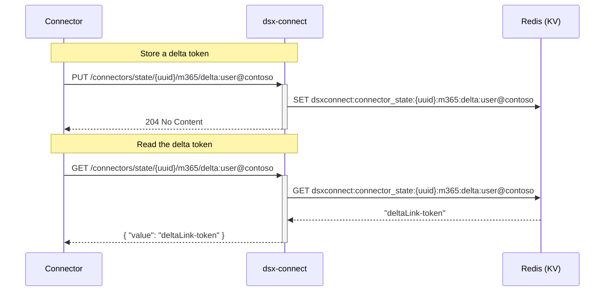

# Connector State KV (dsx‑connect)

Connectors are intended to be stateless, as it promotes simple, "do-your-job" connectors, that focus on a few single tasks, and not complex interactions, fault tolerance, redundancy, etc....
For example, if a connector crashes, simply restart and the dsx-connect core will pick up where things left off.

However, there are cases where connectors need to utilize state, such retaining delta tokens or cursors that tracks Microsoft Graph changes (see Sharepoint/One Drive connectors).
In this case, where a saved state is needed for resuming work after connector restarts or redeployments (e.g., persisting the latest Graph delta cursor so the next run can
pick up from the correct change token), connectors should use dsx‑connect APIs to store small, key/values. 

## Endpoints

- PUT `/dsx-connect/api/v1/connectors/state/{connector_uuid}/{ns}/{key}`
  - Auth: DSX‑HMAC (connector → dsx‑connect)
  - Body: raw string (e.g., delta token)
  - Stores under Redis key: `dsxconnect:connector_state:{uuid}:{ns}:{key}`
  - Response: 204 No Content on success

- GET `/dsx-connect/api/v1/connectors/state/{connector_uuid}/{ns}/{key}`
  - Auth: DSX‑HMAC (connector → dsx‑connect)
  - Response: `{ "value": "..." }` (string or empty if missing)

## Notes
- Designed for small values (a few KB). Not a general database.
- HMAC protects read/write; policy is per‑connector (by UUID).
- Keys are namespaced by `{ns}` to avoid collisions across features.

## Mermaid: State KV Flow



## Minimal Curl Examples

- Store:
```bash
curl -s -X PUT \
  -H "Authorization: DSX-HMAC key_id=<kid>, ts=<ts>, nonce=<nonce>, sig=<sig>" \
  --data 'deltaLink-token' \
  http://dsx-connect-api/dsx-connect/api/v1/connectors/state/<uuid>/m365/delta:user@contoso
```

- Fetch:
```bash
curl -s \
  -H "Authorization: DSX-HMAC key_id=<kid>, ts=<ts>, nonce=<nonce>, sig=<sig>" \
  http://dsx-connect-api/dsx-connect/api/v1/connectors/state/<uuid>/m365/delta:user@contoso
```
