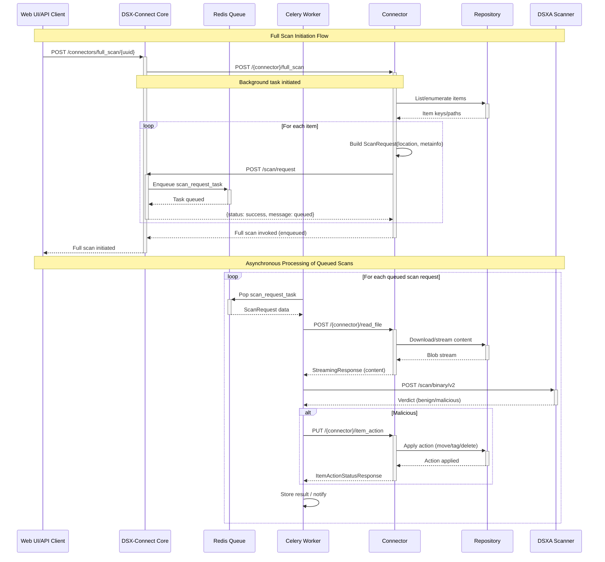

# DSX‑Connect Overview

DSX‑Connect is a modular integration framework that orchestrates safe, scalable file scanning and remediation while remaining completely agnostic to specific repository integrations. The core “scan brain” handles queuing, parallelism, and remediation; DSX‑Connectors adapt repositories (Filesystem, S3, GCS, SharePoint/OneDrive, GitHub, etc.) to a simple, consistent API.

## Key Components

- **DSX‑Connect (Core):**
  - Receives scan requests, fetches file content from connectors, invokes scanning, and applies remediation.
  - Scales from one file to billions using queues and horizontally scalable workers.
  - Integration‑agnostic: depends only on a stable connector API.

- **DSX‑Connectors:**
  - Service‑specific adapters that implement a consistent API:
    - `startup` / `shutdown`
    - `full_scan` (optional): enumerate and enqueue scan requests
    - `read_file`: stream binary content
    - `item_action`: delete/move/tag on verdicts
    - `webhook_event`: ingest provider notifications
    - `repo_check`, `estimate`, `config`, health/readiness

## Architecture Advantages

- **Clear delineation:** Core orchestrates scanning; connectors handle repository semantics (list/read/act).
- **Event‑driven:** Queues decouple enumeration, scanning, and remediation for high throughput and resilience.
- **Fault tolerant & HA:** Retries with exponential backoff, dead letter queues (DLQ), graceful degradation.
- **Scalable & flexible:** Add new repositories by writing a connector; scale worker pools independently.
- **Consistent & pluggable:** All connectors share the same API contract; updating one doesn’t disrupt others.
- **Observability:** Health endpoints, queue metrics, DLQ management, structured logs.

## Standard Connector API (Summary)

- `full_scan`: enumerate items and enqueue scan requests (streaming enumeration recommended)
- `read_file`: retrieve file content (binary stream)
- `item_action`: perform remediation (delete/move/tag)
- `webhook_event`: handle provider events to trigger scans
- `repo_check`: verify connectivity
- `estimate` (optional): preflight sizing
- `config`: surface runtime configuration (secrets redacted)

## Example Workflow (Filesystem Connector)

1. Deploy connector with access to a folder/share.
2. Trigger `full_scan` — the connector enumerates files and enqueues scan requests asynchronously.
3. DSX‑Connect scan‑request workers call `read_file`, stream → scan → verdict → enqueue remediation.
4. Verdict workers call `item_action` on the connector (delete/move/tag).

Benefits of decoupling: resiliency (queue persistence), scale (parallel workers), and isolation (enumeration doesn’t block scanning).

### Filesystem Example (Image)


## Architecture Diagram


Below is a high‑level Mermaid diagram that complements the static overview:

```mermaid
flowchart LR
  UI[Web UI / API Client]
  DSX[DSX‑Connect Core]
  Q[(Redis Queues)]
  Wk[Scan Request Workers]
  Conn[Connector]
  Repo[(Repository)]
  DSXA[DSXA Scanner]

  UI -->|full_scan| DSX
  DSX -->|POST full_scan| Conn
  Conn -->|Enumerate| Repo
  Conn -->|POST scan_request| DSX
  DSX -->|Enqueue| Q
  Wk -->|Dequeue| Q
  Wk -->|POST read_file| Conn
  Conn -->|Stream content| Wk
  Wk -->|Scan binary| DSXA
  DSXA -->|Verdict| Wk
  Wk -->|item_action (if malicious)| Conn
```

## Sequence: Full Scan (Mermaid)

This is a more detailed sequence adapted from the Confluence page.



## Deployment Models

- **Docker Compose (Test/POV):** Quick, portable evaluation for demos and development (single VM/laptop). Minimal dependencies.
- **Kubernetes + Helm (Production):** Scalable, resilient, and portable across AKS/EKS/GKE/OKE. Integrates with HA Redis, object storage, and logging.

Both models use the same container images and configuration patterns, easing promotion from test to prod.

## Fault Tolerance & High Availability

- **Retries & DLQ:** Intelligent retries per failure type (connector/DSXA/timeouts/rate limits). DLQ preserves failed tasks for reprocessing.
- **Graceful degradation:** Continue accepting/queuing when downstreams are degraded; resume automatically.
- **HA patterns:** Stateless workers; shared queues; multiple API replicas; connectors operate independently.

## Operational Guidance (Highlights)

- Use HA Redis (cluster/sentinel); spread workers; load‑balance the API.
- Monitor: queue depths, DLQ accumulation, failure rates, connector availability, scanner response times.
- Idempotent operations: safe retries without duplication or corruption.

## Writing a New Connector

1) Define connector configuration (pydantic BaseSettings).
2) Instantiate `DSXConnector(config)` and implement handlers:
   - `@connector.startup` / `@connector.shutdown`
   - `@connector.full_scan` / `@connector.read_file` / `@connector.item_action`
   - `@connector.webhook_event` / `@connector.repo_check`
3) Run with Uvicorn: `connectors.framework.dsx_connector:connector_api`.

> Tip: stream wherever feasible (enumeration, downloads) to handle very large repositories efficiently.
