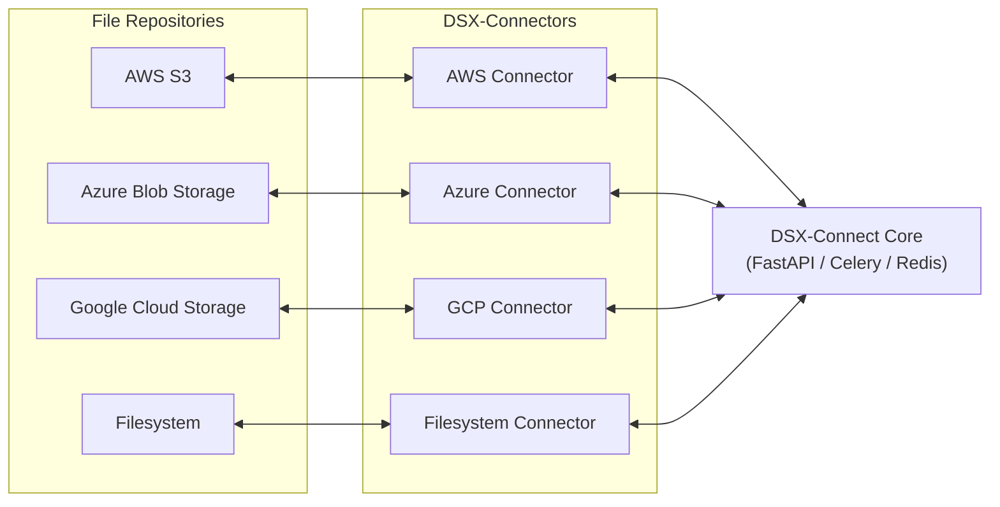
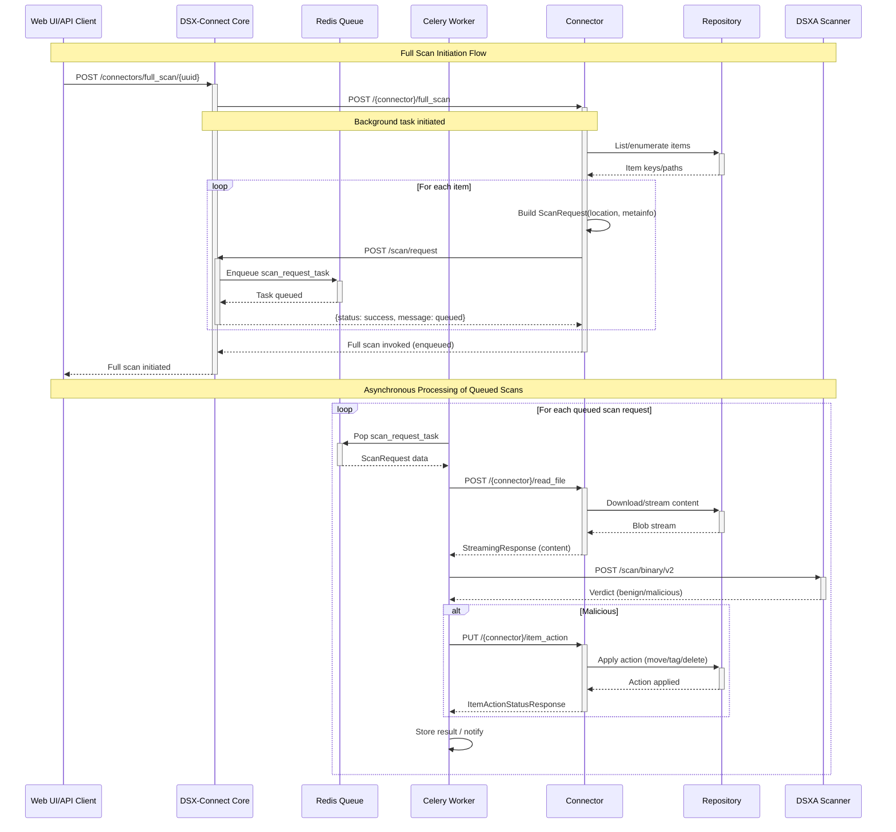

# DSX‑Connect Overview

DSX‑Connect is a modular integration framework that orchestrates safe, scalable file scanning and remediation while remaining completely agnostic to specific repository integrations. The core “scan brain” handles queuing, parallelism, and remediation; DSX‑Connectors adapt repositories (Filesystem, S3, GCS, SharePoint/OneDrive, GitHub, etc.) to a simple, consistent API.

## Key Components

- **DSX‑Connect (Core):**
  - Receives scan requests, fetches file content from connectors, invokes scanning, and applies remediation.
  - Scales from one file to billions using queues and horizontally scalable workers.
  - Integration‑agnostic: depends only on a stable connector API.

- **DSX‑Connectors (Connectors):**
  - Connectors implement a consistent API and focus on the specifics of a repository.
  - Easily extendable: add new connectors to support new repositories.
  - Stateless and can be deployed independently.

## Architecture Advantages

- **Clear delineation:** DSX-Connect core orchestrates scanning, verdict handling, logging, etc...; connectors handle repository specific semantics (list/read/actions).
- **Event‑driven:** Queues decouple enumeration, scanning, and remediation for high throughput and resilience.
- **Fault tolerant & HA:** Retries with exponential backoff, dead letter queues (DLQ), graceful degradation.
- **Scalable:** Core Worker pools handle parallelism and scaling; connectors operate independently.
- **Flexible:** Add new repositories by writing a connector; core components stay the same.
- **Consistent & pluggable:** All connectors share the same API contract; updating one doesn’t disrupt others.
- **Observability:** Health endpoints, queue metrics, DLQ management, structured logs.

## Example Workflow

The following diagram illustrates a simplified workflow of DSX-Connect, deployed with Scan Request and Verdict workers, and a Filesystem Connector.  First,
a quick overview of connector APIs relevavnt to this example:

- `full_scan`: enumerate items and enqueue scan requests (streaming enumeration recommended)
- `read_file`: retrieve file content (binary stream)
- `item_action`: perform remediation (delete/move/tag)

Filesystem Connector deployed with access to a folder: ~/Documents, and quarantine folder set to ~/Documents/quarantine.

1. DSX-Connect triggers a `full_scan` on the connector then...
2. the connector lists all files in ~/Documents and for each file...
3. sends Scan Requests to DSX-Connect which queues each request.  
4. DSX‑Connect Scan Request Worker dequeues a Scan Request and... 
5. Requests the file from the connector (`read_file`), and...
6. scan the file with DSXA and places the DSXA verdict in the Verdict Queue.
7. Verdict Worker dequeues a verdict and then, on a malicious verdict,
8. calls on the connector's `item_action` to take action the connector (delete/move/tag the file). In this case, the Filesystem Connector moves the file to ~/Documents/quarantine.

Benefits of decoupling: resiliency (queue persistence), scale (parallel workers), and isolation (enumeration doesn’t block scanning).

### Filesystem Example (Image)

## Architecture Diagram

Below is a high‑level Mermaid diagram that complements the static overview:

## Sequence: Full Scan (Mermaid)

This is a more detailed sequence adapted from the Confluence page.

## Deployment Models

- **Docker Compose (Test/POV):** Quick, portable evaluation for demos and development (single VM/laptop). Minimal dependencies.
- **Kubernetes + Helm (Production):** Scalable, resilient, and portable across AKS/EKS/GKE/OKE. Integrates with HA Redis, object storage, and logging.

Both models use the same container images and configuration patterns, easing promotion from test to prod.

## Fault Tolerance & High Availability

- **Retries & DLQ:** Intelligent retries per failure type (connector/DSXA/timeouts/rate limits). DLQ preserves failed tasks for reprocessing.
- **Graceful degradation:** Continue accepting/queuing when downstreams are degraded; resume automatically.
- **HA patterns:** Stateless workers; shared queues; multiple API replicas; connectors operate independently.

## Operational Guidance (Highlights)

- Use HA Redis (cluster/sentinel); spread workers; load‑balance the API.
- Monitor: queue depths, DLQ accumulation, failure rates, connector availability, scanner response times.
- Idempotent operations: safe retries without duplication or corruption.

## Writing a New Connector

1) Define connector configuration (pydantic BaseSettings).
2) Instantiate `DSXConnector(config)` and implement handlers:
   - `@connector.startup` / `@connector.shutdown`
   - `@connector.full_scan` / `@connector.read_file` / `@connector.item_action`
   - `@connector.webhook_event` / `@connector.repo_check`
3) Run with Uvicorn: `connectors.framework.dsx_connector:connector_api`.

> Tip: stream wherever feasible (enumeration, downloads) to handle very large repositories efficiently.
