# dsx-connect Deployment

Note for GCS connector development (IDE/debug):
- Create `connectors/google_cloud_storage/.dev.env` with:
  - `GOOGLE_APPLICATION_CREDENTIALS=/abs/path/to/your-service-account.json`
  - `DSXCONNECTOR_ASSET=your-gcs-bucket`
The connector's config loader reads this `.dev.env` and sets these env vars so the Google SDK can authenticate locally.

## Table of Contents
- [Distribution Structure](#distribution-structure)
- [dsx-connect Components](#dsx-connect-components)
- [Test Deployment](#test-deployment-quick-start)
  - [Running on the Command Line](#running-on-the-command-line)
- [API Reference](#api-reference)


## Distribution Structure
This distribution (dsx-connect-<version>/) contains:

- dsx_connect/: Core application code (FastAPI app, Celery workers, etc.).
- shared/: Shared modules used across core and connectors.
- Dockerfile, docker-compose-*.yaml: Docker deployment files.
- dsx_connect/dsx-connect-api-start.py, dsx_connect/dsx-connect-workers-start.py: Helper scripts to run API/workers.
- requirements.txt: Python dependencies.
- certs/: Dev TLS certs (optional; for local HTTPS testing only).
- helm/: Raw Helm chart for dsx-connect (umbrella + subcharts).
- charts/: Packaged Helm chart tarball(s) for dsx-connect (e.g., dsx-connect-<version>.tgz).
- README.md: This file.

### Install Helm Chart from the Bundle

If you used `inv prepare` or `inv release`, a packaged chart is available under `charts/`.

Example install (pinning image tag via values):

```bash
helm upgrade --install dsx dist/dsx-connect-<version>/charts/dsx-connect-<version>.tgz \
  --set-string global.image.tag=<version> \
  --set-string global.env.DSXCONNECT_SCANNER__SCAN_BINARY_URL=https://my-dsxa.example.com/scan/binary/v2
```

Or from the raw chart directory in the bundle:

```bash
helm upgrade --install dsx dist/dsx-connect-<version>/helm \
  --set-string global.image.tag=<version> \
  --set-string global.env.DSXCONNECT_SCANNER__SCAN_BINARY_URL=https://my-dsxa.example.com/scan/binary/v2
```


## dsx-connect Components


* dsx-connect app: 
  * a FastAPI app, that provides the API endpoints that Connectors talk to.  
  * Manages configuration of architecture
* Scan Request, Verdict, and Scan Result Queue - implemented as Celery/Redis queues.  
* Scan Request, Verdict and Scan Result Workers - Celery apps which can be deployed individually or together

## Deployment
There are two modes for deploying dsx-connect.  One mode is a testing mode in which only the dsx-connect app 
needs to be running.  The other is a full deployment mode, which is what you should opt for in environments 
where a lot of files need processing.  

## Test Deployment (Quick Start)

In this type of deployment, only dsx-connect needs to be running, along with 
whatever connector you are using and DSXA.


When a Connector is run in Test mode (more on this later), it will call the dsx-connect API endpoint: test/scan_request 
on the dsx-connect app.  The dsx-connect app will then request read_file from the Connector, 
and then scan the file, and finally invoke item_action if necessary.   

The easiest way to start this workflow, is to spawn a Connector and invoke a full_scan on the Connector
by calling its full_scan API.

### Running on the Command Line
The simplest way to start is to simply run a connector and dsx-connect from the command line.  
The following assumes a running publicly accessible DSXA instance.

Grab a release of dsx-connect, and navigate to the root directory.  Start by installing all 
necessary modules.

(optional) Start by creating a new python virtual environment within the dsx-connect to avoid 
conflicts with existing python installations of modules:   
```commandline
python -m venv venv  
```
and then activate the venv:
```commandline
./venv/Scripts/activate (Mac / Linux) or .\venv\Scripts\activate (Windows)
```
Install requirements:
```
pip install -r requirements.txt
```
Next, we will likely want to change some configurations in dsx-connect, starting with the DSXA scanner 
it's connected.  The easiest way to do this is via changing environment settings to override defaults.

The dsx_config/config.py file defines all fo the defaults (using Pydantic's BaseSettings), however, you 
probably don't want to edit these directly in the python script unless you want to permanently change
the defaults (for example, to set the scan_binary_url to a known, always on, DSXA instance.)

#### Option 1: Export Environment Settings  
```shell
export LOG_LEVEL=debug
export DSXCONNECT__SCANNER__SCAN_BINARY_URL=http://new-url.com/scan/binary/v2
```

#### Option 2: Pass Environment Settings on Command Line (recommended)
You can also just make these settings before launching dsx-connect on the same command line.  
For example, if you wanted to set the LOG_LEVEL to debug, you would simply do something like this:
```shell
LOG_LEVEL=debug python dsx-connect-api1-start.py
```

#### Starting the dsx-connect app

There is a helper script called dsx-connect-start.py in the root directory.  It simply encapsulates
the call to launch the uvicorn ASGI and host the dsx-connect app.

Here's how to launch with overrides to LOG_LEVEL and the SCAN_BINARY_URL
```shell
LOG_LEVEL=debug \
DSXCONNECT__SCANNER__SCAN_BINARY_URL=http://a0c8b85f8a14743c6b3de320b780a359-1883598926.us-west-1.elb.amazonaws.com/scan/binary/v2 \
python dsx-connect-api1-start.py
```

You should see output like this:
```shell
2025-04-25 13:00:19,487 INFO     logging.py          : Log level set to INFO
INFO:     Started server process [75934]
INFO:     Waiting for application startup.
2025-04-25 13:00:19,982 INFO     dsx_connect_api.py  : dsx-connect version: <module 'dsx_connect.version' from '/Users/logangilbert/PycharmProjects/SEScripts/build/dist/dsx-connect-0.0.19/dsx_connect/version.py'>
2025-04-25 13:00:19,982 INFO     dsx_connect_api.py  : dsx-connect configuration: results_database=DatabaseConfig(loc='redis://redis:6379/3', retain=100) scanner=ScannerConfig(scan_binary_url='http://a0c8b85f8a14743c6b3de320b780a359-1883598926.us-west-1.elb.amazonaws.com/scan/binary/v2')
2025-04-25 13:00:19,982 INFO     dsx_connect_api.py  : dsx-connect startup completed.
INFO:     Application startup complete.
INFO:     Uvicorn running on http://0.0.0.0:8586 (Press CTRL+C to quit)
```

You can now open a browser to view dsx-connect's APIs:
http://0.0.0.0:8586

And should see a page like this:


Note the scanner -> scan_binary_url should show the URL you overrode in the environment setting. 

# dsx-connect Workflow


Complete description of workflow here:
https://di-jira.atlassian.net/wiki/x/JoDJOQE

# Creating New Releases 

To create a new release of DSX-Connect using invoke tasks:

1. Prerequisites:

* Install invoke and dependencies:cd dsx-connect/dsx_connect
```pip install invoke -r requirements.txt```

* Ensure Docker is installed and you’re authenticated with Docker Hub (if using the push task):
```docker login```

2. Run the Release Task:

From the dsx_connect/ directory, execute:
```inv release```

* This performs the following:
  * Bumps the patch version in version.py (e.g., 0.1.0 to 0.1.1). 
  * Cleans previous build artifacts (dist/). 
  * Prepares the distribution (dsx-connect-<version>/) with application code, Dockerfile, docker-compose.yaml, and helper files. 
  * Zips the distribution into dsx-connect-<version>.zip. 
  * Builds the Docker image (dsx-connect:<version>). 
  * Pushes the image to Docker Hub (dsxconnect/dsx-connect:<version>).


3. Verify the Release:

Check the new distribution in dist/dsx-connect-<version>/.
Test the Docker image:
```cd dist/dsx-connect-<version>```
```docker-compose up -d```

Access the the app home page at http://localhost:8586.


Individual Tasks (Optional):

Run specific tasks if needed:
```
inv bump  # Increment version
inv clean  # Remove build artifacts
inv prepare  # Prepare distribution files
inv zip  # Create zip archive
inv build  # Build Docker image
inv push  # Push to Docker Hub
```

# Deployment via Docker Compose

## Create a docker network

dsx-connect and connectors running in docker via docker compose expect that a docker "network" has been created 
that they can communicate on within the docker environment.  
```docker network create dsx-connect-network --driver bridge```

## docker compose file and Configuration
In the docker-compose.yaml file, note that it will be run a few services:
* dsx_connect_api - the API service which connectors talk to and provides API access to scan results and statistics 
* dsx_connect_workers - Celery apps which dequeue and execute tasks in the task queues
* redis - used by celery as a task broker
* rsyslog (optional) - Optional syslog container where dsx-connect's scan results worker will send syslog results 

### dsx_connect_workers Service Configuration

Default configuration is defined in the `config.py` file.  This can be edited directly, however, just keep in mind 
that config.py file defines default config values for all future deployments.  Best practice deployment is 
to override settings with environment settings in the deployment script.  

NOTE: config.fy is an implementation of Pydantic's BaseSettings and as such, provides a handy way to pass environment
settings or .env file to override default settings during deployments.

```yaml
dsx_connect_api:
  build:
    context: .
    dockerfile: Dockerfile
  ports:
    - "8586:8586"
  environment:
  - PYTHONUNBUFFERED=1
  - DSXCONNECT_TASKQUEUE__BROKER=redis1://redis1:6379/0
  - DSXCONNECT_TASKQUEUE__BACKEND=redis1://redis1:6379/0
  - DSXCONNECT_RESULTS_DB=redis://redis:6379/3
  - DSXCONNECT_RESULTS_DB__RETAIN=100
  - DSXCONNECT_SCANNER__SCAN_BINARY_URL=http://dsxa_scanner:5000/scan/binary/v2
  - LOG_LEVEL=debug
  depends_on:
  - redis1
  networks:
    dsx-network:
      aliases:
        - dsx-connect-api1 # this is the name connectors will use to connect to the dsx_connect_core service API on the dsx-connect-network docker network
  command: uvicorn dsx_connect.app.dsx_connect_api:app --host 0.0.0.0 --port 8586
```

#### Environment Overrides

- **DSXCONNECT_SCANNER__SCAN_BINARY_URL:** DSXA's scan/binary/v2 URL.  In this example, DSXA has been deployed via the docker-compose-dsxa.yaml file, in which case it will reside on the same netowrk as this service, under the name dsxa_scanner.  Otherwise, this could refer to a complete URL to a running DSXA instance, such as: http://a0c8b85f8a14743c6b3de320b780a359-1883598926.us-west-1.elb.amazonaws.com/scan/binary/v2

Next there are settings to change the scan results database location and retention policy.  Note that the dsx-connect databases are meant for ease of reviewing scan results - both benign and malicious verdicts.
- Results/Stats DB options: memory or Redis only.
- **DSXCONNECT_RESULTS_DB:** DB URL; `redis://...` uses Redis, anything else uses in-memory.
  - memory - not used
  - Redis: set DSXCONNECT_RESULTS_DB to a `redis://` URL (e.g., redis://redis:6379/3). Any other value falls back to in-memory (non-persistent).
  - mongodb - the URL to the mongo instance
- **DSXCONNECT_RESULTS_DB__RETAIN**: retention policy for scan results. For Redis this caps the list size via LTRIM.
  - Settings:
  - -1: retain forever
  - 0: retain nothing
  - n: retain n records

### dsx_connect_workers Service Configuration
The Workers follow a similar method of overriding default configurations.   

#### Environment Overrides

- **DSXCONNECT_SCANNER__SCAN_BINARY_URL:** DSXA's scan/binary/v2 URL.  In this example, DSXA has been deployed via the docker-compose-dsxa.yaml file, in which case it will reside on the same netowrk as this service, under the name dsxa_scanner.  Otherwise, this could refer to a complete URL to a running DSXA instance, such as: http://a0c8b85f8a14743c6b3de320b780a359-1883598926.us-west-1.elb.amazonaws.com/scan/binary/v2.  
  - Yes, this should be the same as the dsx_connect_api scan binary URL.  This is a little hokey, but this docker compose method was intended for simplicity in deployment.  Ideally one could use an .env file to set environments for all services, or, something like helm charts for deployment in clustered environments.
- **DSXCONNECT_SCAN_RESULT_TASK_WORKER__SYSLOG_SERVER_URL:** default 'rsyslog' - the service defined in the same docker-compose file, otherwise, use the complete URL to a syslog server 
- **DSXCONNECT_SCAN_RESULT_TASK_WORKER__SYSLOG_SERVER_PORT:** the port the syslog server is listening on


## Using Docker Compose
To deploy DSX-Connect using Docker Compose:

1. Navigate to the Distribution:
```cd dsx-connect-<version>```

2. Build the Docker Image (if not already built):
Use invoke release (see above) or
```docker build -t dsx-connect:<version> .```

3. Start the Services:
```docker-compose up -d``` or ```docker compose up -d```

Should result in this (replacing 0110 with the version of the image used):
```
[+] Running 4/4
✔ Network dsx-connect-0110_dsx-network              Created                                                                                                                                                                               0.1s
✔ Container dsx-connect-0110-redis-1                Started                                                                                                                                                                               0.3s
✔ Container dsx-connect-0110-dsx_connect_workers-1  Started                                                                                                                                                                               0.4s
✔ Container dsx-connect-0110-dsx_connect_app-1      Started
```                                                                                                                                                                               


4. Verify Deployment:


* The FastAPI app runs on http://localhost:8586/docs.
* Celery workers and Redis run in the background, connected via the dsx-network bridge.
* Check container status: 
  * ```docker-compose ps```
```                                                                                                                                                                               0.4s
NAME                                     IMAGE                                  COMMAND                  SERVICE               CREATED         STATUS         PORTS
dsx-connect-0110-dsx_connect_app-1       dsx-connect-0110-dsx_connect_app       "uvicorn dsx_connect…"   dsx_connect_app       5 seconds ago   Up 5 seconds   0.0.0.0:8586->8586/tcp
dsx-connect-0110-dsx_connect_workers-1   dsx-connect-0110-dsx_connect_workers   "celery -A dsx_conne…"   dsx_connect_workers   5 seconds ago   Up 5 seconds   
dsx-connect-0110-redis-1                 redis:6                                "docker-entrypoint.s…"   redis                 6 seconds ago   Up 5 seconds   6379/tcp
```

5. Stop the Services:
```docker-compose down```

Note: The docker-compose.yaml is at the distribution root, following standard Docker conventions. Ensure port 8586 is free or edit docker-compose.yaml to use a different port.


# Testing with a Connector

## TODO

DSX-Connect integrates with connectors (e.g., filesystem-connector) for extended functionality. To test with a connector in the monorepo:

Prerequisites:

Ensure the monorepo (dsx-connect/) is cloned, with dsx_connect/ and connectors/ (e.g., connectors/filesystem/).
Install invoke and dependencies in both dsx_connect/ and the connector directory:cd dsx-connect/dsx_connect
pip install invoke -r requirements.txt
cd ../connectors/filesystem
pip install invoke -r requirements.txt

Run DSX-Connect:

Start the DSX-Connect services:cd dsx-connect/dsx_connect
inv build
inv run


This starts the FastAPI app (http://localhost:8586/docs), Celery workers, and Redis.


Build and Run the Connector:

Navigate to the connector directory:cd dsx-connect/connectors/filesystem


Build the connector’s Docker image:inv build


Run the connector:inv run


The connector typically exposes its API (e.g., http://localhost:8587/docs for filesystem).


Test Integration:

Use the DSX-Connect Swagger UI (http://localhost:8586/docs) to submit scan requests.
Verify the connector processes requests via its API (http://localhost:8587/docs).
Check Celery worker logs for task processing:docker logs dsx_connect_workers


Stop Services:

Stop the connector:cd dsx-connect/connectors/filesystem
docker-compose down


Stop DSX-Connect:cd dsx-connect/dsx_connect
docker-compose down


Note: Each connector may have specific configuration (e.g., environment variables, ports). Refer to the connector’s README.md or tasks.py for details.
Troubleshooting

ModuleNotFoundError: No module named 'dsx_connect':Use dsx-connect-start.py or set PYTHONPATH=. when running Uvicorn manually.
Port conflicts:Edit dsx-connect-start.py or docker-compose.yaml to change the port (e.g., 8000).
Docker build issues:Ensure Dockerfile and requirements.txt are in the distribution root.

Development
For the full monorepo, see the source repository. The monorepo uses dsx_connect/deploy/ for Dockerfile and docker-compose.yaml, but the distribution places them at the root for simplicity.

```mermaid
graph TB
    %% External Services
    subgraph "External Services"
        GCS[Google Cloud Storage]
        ABS[Azure Blob Storage]
        S3[AWS S3]
        FS[File System]
        OTHER[Other Storage...]
    end

    %% Connectors Layer
    subgraph "Connectors Layer"
        direction TB
        CONN1[GCS Connector]
        CONN2[Azure Connector] 
        CONN3[AWS Connector]
        CONN4[FileSystem Connector]
        CONN5[Custom Connectors...]
        
        CONN1 -.->|reads files| GCS
        CONN2 -.->|reads files| ABS
        CONN3 -.->|reads files| S3
        CONN4 -.->|reads files| FS
        CONN5 -.->|reads files| OTHER
    end

    %% DSX-Connect Core
    subgraph "DSX-Connect Core"
        direction TB
        
        subgraph "API Layer"
            FASTAPI[FastAPI Server<br/>Web UI & REST API]
            SSE[Server-Sent Events<br/>Real-time Updates]
        end
        
        subgraph "Task Queue System"
            REDIS[Redis<br/>Queue & Cache]
            CELERY[Celery Workers<br/>Distributed Processing]
        end
        
        subgraph "Queue Types"
            SRQ[Scan Request Queue]
            VAQ[Verdict Action Queue] 
            SResultQ[Scan Result Queue]
            DLQ[Dead Letter Queues<br/>Fault Tolerance]
        end
        
        subgraph "Database Layer"
            SCANDB[(Scan Results DB<br/>SQLite/PostgreSQL)]
            STATSDB[(Statistics DB<br/>TinyDB)]
        end
        
        subgraph "Fault Tolerance"
            RETRY[Retry Logic<br/>Exponential Backoff]
            DLQ_MGR[DLQ Management<br/>Recovery & Requeue]
            MONITOR[Health Monitoring<br/>Queue Stats]
        end
    end

    %% DSXA Scanner
    subgraph "DSX Applications (DSXA)"
        DSXA[DSXA Scanner Service<br/>Malware Analysis Engine]
    end

    %% Admin/User Interface
    subgraph "Administration"
        WEBUI[Web Dashboard<br/>Monitoring & Control]
        API[REST API<br/>Programmatic Access]
        CLI[CLI Tools<br/>Admin Operations]
    end

    %% Data Flow Connections
    CONN1 -->|scan requests| FASTAPI
    CONN2 -->|scan requests| FASTAPI
    CONN3 -->|scan requests| FASTAPI
    CONN4 -->|scan requests| FASTAPI
    CONN5 -->|scan requests| FASTAPI
    
    FASTAPI -->|enqueue| SRQ
    SRQ -->|process| CELERY
    
    CELERY -->|fetch file| CONN1
    CELERY -->|fetch file| CONN2
    CELERY -->|fetch file| CONN3
    CELERY -->|fetch file| CONN4
    CELERY -->|scan binary| DSXA
    
    CELERY -->|verdict| VAQ
    VAQ -->|action decision| CELERY
    CELERY -->|results| SResultQ
    SResultQ -->|store| SCANDB
    SResultQ -->|stats| STATSDB
    
    %% Fault Tolerance Flows
    CELERY -.->|on failure| RETRY
    RETRY -.->|max retries<br/>exceeded| DLQ
    DLQ -.->|requeue| SRQ
    
    MONITOR -.->|health checks| CELERY
    MONITOR -.->|queue stats| REDIS
    
    %% Admin Interfaces
    WEBUI -.->|monitor| FASTAPI
    API -.->|control| FASTAPI
    CLI -.->|admin ops| DLQ_MGR
    
    REDIS -->|pub/sub| SSE
    SSE -->|real-time| WEBUI
    
    %% Styling
    classDef connector fill:#e1f5fe,stroke:#01579b,stroke-width:2px
    classDef core fill:#f3e5f5,stroke:#4a148c,stroke-width:2px
    classDef scanner fill:#fff3e0,stroke:#e65100,stroke-width:3px
    classDef storage fill:#e8f5e8,stroke:#1b5e20,stroke-width:2px
    classDef queue fill:#fff8e1,stroke:#f57f17,stroke-width:2px
    classDef fault fill:#ffebee,stroke:#c62828,stroke-width:2px
    classDef admin fill:#f1f8e9,stroke:#33691e,stroke-width:2px
    
    class CONN1,CONN2,CONN3,CONN4,CONN5 connector
    class FASTAPI,CELERY,REDIS,SCANDB,STATSDB,SSE core
    class DSXA scanner
    class GCS,ABS,S3,FS,OTHER storage
    class SRQ,VAQ,SResultQ queue
    class DLQ,RETRY,DLQ_MGR,MONITOR fault
    class WEBUI,API,CLI admin
```


