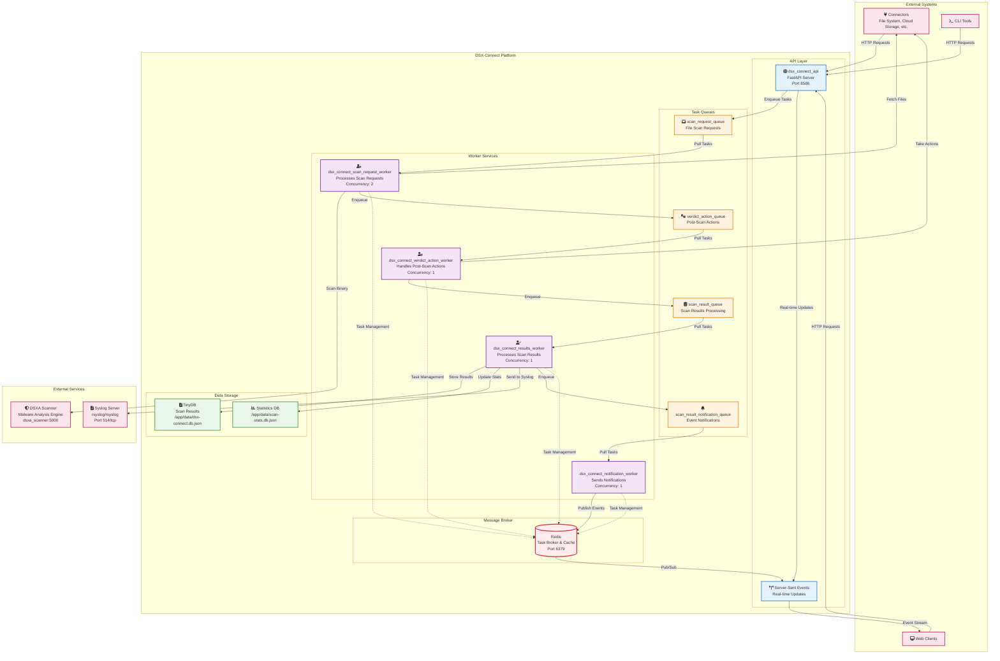

# dsx-connect Deployment

## Quick Start
This package contains docker compose files that should just run as-is without any changes to configuration.  If you
just want to deploy now and learn more later:

[Jump to: "Using Docker Compose"](#using-docker-compose)

## Files in this Package
- docker-compose-dsxa.yaml: docker compose for running DSXA scanner.  Not necessary, but here for convenience.
- docker-compose-dsx-connect-all-services.yaml: runs all services related to dsx-connect
- README.md: this file
- certs/: dev TLS certs and script to generate self-signed certificates

## Components
dsx-connect is comprised of several services:


* dsx-connect app: 
  * a FastAPI app, that provides the API endpoints that Connectors talk to.  
  * Manages configuration of architecture
* Scan Request, Verdict, Scan Result Queue (and potentially more as the architecture grows) - implemented as Celery/Redis queues.  
* Scan Request, Verdict and Scan Result Workers - Celery based apps that pull queue items and work on those tasks
* redis: the broker for queueing tasks
* rsyslog: docker deployable rsyslog server to demonstrate basic syslog functionality

### DSX-Connect Architecture Overview

DSX-Connect is a distributed malware scanning platform built on FastAPI and Celery, designed to handle high-volume file scanning operations through a queue-based architecture.

#### System Architecture



## Component Details

### Core Services

#### **dsx_connect_api** (FastAPI Server)
- **Purpose**: HTTP API endpoint for all client interactions
- **Port**: 8586 (HTTPS optional via TLS)
- **Features**:
  - RESTful API for scan requests and results
  - Server-Sent Events (SSE) for real-time updates to frontend UI
  - Web-based dashboard and monitoring
  - Task queue management and status
- **Dependencies**: Redis (message broker)

TLS/SSL:
- Dev certs can be generated under `deploy/docker/certs` (see `generate-dev-cert.sh`). The image includes `/app/certs`.
- Enable in compose:
  - `DSXCONNECT_USE_TLS=true`
  - `DSXCONNECT_TLS_CERTFILE=/app/certs/dev.localhost.crt`
  - `DSXCONNECT_TLS_KEYFILE=/app/certs/dev.localhost.key`
- Connectors verifying HTTPS:
  - Prefer `DSXCONNECTOR_VERIFY_TLS=true` and provide `DSXCONNECTOR_CA_BUNDLE=/app/certs/ca.pem` if using private CA.
  - For development only, you may set `DSXCONNECTOR_VERIFY_TLS=false`.

Using your own TLS certificates (production)
- Option A: Volume‑mount certs (no image rebuild)
  - Place your certs on host: `./certs/server.crt`, `./certs/server.key`
  - Compose:
    ```yaml
    services:
      dsx_connect_api:
        volumes:
          - ./certs:/app/certs:ro
        environment:
          DSXCONNECT_USE_TLS: "true"
          DSXCONNECT_TLS_CERTFILE: "/app/certs/server.crt"
          DSXCONNECT_TLS_KEYFILE: "/app/certs/server.key"
    ```
  - Ensure files are readable by the container user (e.g., 0644 for both).
- Option B: Bake certs into the image (set strict perms)
  - Dockerfile overlay:
    ```Dockerfile
    FROM dsxconnect/dsx-connect:__VERSION__
    USER root
    COPY certs/ /app/certs/
    RUN chown -R dsxconnectuser:dsxconnectuser /app/certs \
        && chmod 0644 /app/certs/*.crt || true \
        && chmod 0600 /app/certs/*.key || true
    USER dsxconnectuser
    ```

#### **Redis** (Message Broker)
- **Purpose**: Task queue broker and caching layer
- **Port**: 6379
- **Configuration**:
  - Keyspace notifications enabled for SSE
  - LRU eviction policy
  - Optimized for pub/sub operations
- **Role**: Central coordination point for all worker communication - queues "tasks"

### Worker Services

#### **dsx_connect_scan_request_worker**
- **Queue**: `scan_request_queue`
- **Concurrency**: 2 workers (default)
- **Responsibilities**:
  - Process incoming scan requests from API
  - Fetch files from connectors (filesystem, cloud storage, azure, etc...)
  - Submit files to DSXA scanner for malware analysis
  - Forward results to verdict action queue

#### **dsx_connect_verdict_action_worker**
- **Queue**: `verdict_action_queue`
- **Concurrency**: 1 worker (sequential processing)
- **Responsibilities**:
  - Process scan verdicts from verdict action queue
  - Execute post-scan actions (quarantine, delete, etc.) by calling on the connectors
  - Forward processed results to results queue

#### **dsx_connect_results_worker**
- **Queue**: `scan_result_queue`
- **Concurrency**: 1 worker (default)
- **Responsibilities**:
  - Store scan results in database
  - Update scanning statistics
  - Send results to syslog for external SIEM integration
  - Forward to notification queue

#### **dsx_connect_notification_worker**
- **Queue**: `scan_result_notification_queue`
- **Concurrency**: 1 worker
- **Responsibilities**:
  - Publish real-time events via Redis pub/sub
  - Send notifications to connected SSE clients (i.e., the web frontend)
  - Handle webhook notifications (if configured)

### Data Flow

1. **Request Initiation**: Connectors submit scan requests to the dsx-connect-api service API
2. **Queue Distribution**: API enqueues requests to `scan_request_queue`
3. **File Processing**: Scan request workers fetch files and submit to DSXA
4. **Verdict Processing**: Verdict workers handle scan results and take actions
5. **Result Storage**: Results workers store data and send to external systems
6. **Real-time Updates**: Notification workers publish events to connected clients

### External Integrations

#### **DSXA Scanner**
- **Endpoint**: `http://<<dsxa_scanner URL>>/scan/binary/v2` default: `http://dsxa_scanner:5000/scan/binary/v2` if running in same docker host environment
- **Purpose**: Core malware analysis engine
- **Integration**: HTTP API calls from scan request workers

#### **Log Collector (syslog)**
- Choice via Compose profiles: use either `syslog-ng` or `rsyslog` (exactly one).
- Both are configured to emit received logs to container stdout for easy `docker logs` viewing.
- Ports: internal 514/TCP and 514/UDP inside the Compose network.
- Integration: Results worker sends JSON events to host `syslog` on port 514 (TCP by default).

Enable one collector (no bind mounts; config is embedded in Compose):
```bash
# syslog-ng (writes to stdout)
docker compose -f docker-compose-dsx-connect-all-services.yaml --profile syslog-ng up -d

# rsyslog (writes to stdout)
docker compose -f docker-compose-dsx-connect-all-services.yaml --profile rsyslog up -d
```

Disable collector entirely (stdout only on app containers):
- Start without either profile; optionally remove or override `DSXCONNECT_SYSLOG__*` env on the results worker to avoid connecting to a collector.
- You can point to an external collector by setting `DSXCONNECT_SYSLOG__SYSLOG_SERVER_URL` to a hostname outside Compose.

## Deployment via Docker Compose

### Create a Docker Network

dsx-connect and connectors running in docker via docker compose expect that a docker "network" has been created 
that they can communicate on within the docker environment.  
```docker network create dsx-connect-network --driver bridge```

### docker compose File and Configuration
In the docker-compose-dsx-connect-all-services.yaml file, note that it will run several services:
* **dsx_connect_api** - the FastAPI service which connectors talk to and provides API access to scan results and statistics
* **dsx_connect_scan_request_worker** - Celery worker that processes incoming scan requests and coordinates with DSXA scanner
* **dsx_connect_verdict_action_worker** - Celery worker that handles post-scan actions (quarantine, delete, etc.)
* **dsx_connect_results_worker** - Celery worker that processes scan results and sends to external systems (syslog, databases)
* **dsx_connect_notification_worker** - Celery worker that handles real-time notifications and event publishing
* **redis** - used by celery as a task broker and for pub/sub messaging
* **rsyslog** (optional) - Optional rsyslog container where dsx-connect's results worker will send security events

### Service Configuration

#### Commonly Shared Configuration
Where there is a common set of configurations used by two or more services, environment settings will be 
defined in the x-common-env area: 
```yaml
x-common-env: &common-env
  # API key removed (use JWT/HMAC)
  DSXCONNECT_SCANNER__SCAN_BINARY_URL: "http://dsxa_scanner:5000/scan/binary/v2"
  DSXCONNECT_TASKQUEUE__BROKER: "redis://redis:6379/0"
  DSXCONNECT_TASKQUEUE__BACKEND: "redis://redis:6379/0"
  DSXCONNECT_RESULTS_DB: redis://redis:6379/3
  DSXCONNECT_RESULTS_DB__RETAIN: 100
  PYTHONUNBUFFERED: 1
```

###### Scanner Integration:

- **DSXCONNECT_SCANNER__SCAN_BINARY_URL:** DSXA's scan/binary/v2 URL. In this example, DSXA has been deployed via the docker-compose-dsxa.yaml file, in which case it will reside on the same network as this service, under the name dsxa_scanner. Otherwise, this could refer to a complete URL to a running DSXA instance, such as: http://a0c8b85f8a14743c6b3de320b780a359-1883598926.us-west-1.elb.amazonaws.com/scan/binary/v2
Next there are settings to change the scan results database location and retention policy. Note that the dsx-connect databases are meant for ease of reviewing scan results - both benign and malicious verdicts.

##### Core Infrastructure:

- **DSXCONNECT_TASKQUEUE__BROKER:** Redis URL for the Celery task broker. This is where Celery queues tasks for worker processing. Format: redis://hostname:port/database_number. In this example, redis://redis:6379/0 connects to the Redis service named "redis" on port 6379, using database 0.
- **DSXCONNECT_TASKQUEUE__BACKEND:** Redis URL for the Celery result backend. This is where Celery stores task results and status information. Should typically be the same as the broker URL for simplicity, though they can be different Redis instances if needed for scaling.

#### Scan Result Infrastructure (optional, necessary if Scan Results Worker active)
Scan results and statistics are stored in databases as a convenience for demos and POVs.  The dsx-connect-api provides API calls
to pull scan statistics and results, but realistically for a production style deployment, handling of scan results especially should be
offloaded to a third party logging/event handler, such as a syslog server or SIEM.

##### Defined in the common env settings:
- Results/Stats DB options: memory or Redis.
- **DSXCONNECT_RESULTS_DB:** DB URL; `redis://...` uses Redis, anything else uses in-memory.
- **DSXCONNECT_RESULTS_DB__RETAIN:** retention policy for the scan results list. For Redis this caps the list size via LTRIM.
  - Settings:
    - -1: retain forever
    - 0: retain nothing
    - n: retain n records

##### Defined in the service 'dsx_connect_results_worker' env settings:
- **DSXCONNECT_SYSLOG__SYSLOG_SERVER_URL:** host for the syslog collector; defaults to `syslog` (a network alias provided by the enabled profile). Remove/override to disable.
- **DSXCONNECT_SYSLOG__SYSLOG_SERVER_PORT:** collector port (default: 514).
- **DSXCONNECT_SYSLOG__TRANSPORT:** `tcp|udp|tls` (default: tcp).
- **DSXCONNECT_FRONTEND__URL:** URL for the API service (used for notifications).

#### Log Level
- **LOG_LEVEL:** each service can be configured to provide console output at their own log levels (debug, info, warning, error)

#### Worker Services Queue and Concurrency Settings

Each worker service processes a specific queue, which should remain unchanged, but listed below for troubleshooting purposes.  Note that the 
```--loglevel``` is in reference to the celery (the application framework for Workers) log level, not the worker's log level.  
If you suspect issues with queues or workers, this could be set to a debug level along with the LOG_LEVEL of the services.  Otherwise, 
keep this at warning or error, as it can be rather noisy.

Concurrency settings ```--concurrency=n``` will dictate the number of running worker processes fo that type.  The scan_request worker
is the most likely service needing to have this value tweaked, as it's job is take a 1) scan request task from the scan_request_queue, 2) read a file from a connector, 3) request a scan from DSXA, and finally, 4) queue the verdict.  
2 or 3 could be time-consuming IO operations and as such, the more scan request workers working, the more scanning in parallel.  
Note that parallel scanning would also necessitate that the connector can handle parallel read file requests and the DSXA scanner
could handle parallel scan requests (refer to their respective documentation for how to do this).

- **dsx_connect_scan_request_worker:**
  - Queue: `scan_request_queue`
  - Concurrency: 2
  - Command: `celery -A dsx_connect.celery_app.celery_app worker --loglevel=warning -Q scan_request_queue --concurrency=2`

- **dsx_connect_verdict_action_worker:**
  - Queue: `verdict_action_queue`
  - Concurrency: 1
  - Command: `celery -A dsx_connect.celery_app.celery_app worker --loglevel=warning -Q verdict_action_queue --concurrency=1`

- **dsx_connect_results_worker:**
  - Queue: `scan_result_queue`
  - Concurrency: 1
  - Command: `celery -A dsx_connect.celery_app.celery_app worker --loglevel=warning -Q scan_result_queue --concurrency=1`

- **dsx_connect_notification_worker:**
  - Queue: `scan_result_notification_queue`
  - Concurrency: 1
  - Command: `celery -A dsx_connect.celery_app.celery_app worker --loglevel=warning -Q scan_result_notification_queue --concurrency=1`

### Using Docker Compose
To deploy DSX-Connect using Docker Compose:

1. **Create Docker Network:**
   ```bash
   docker network create dsx-connect-network --driver bridge
   ```

2. **Navigate to the Distribution:**
   ```bash
   cd dsx-connect-<version>
   ```

3. **Start DSXA scanner(optional):**
   You can use the following docker compose file to start the DSXA scanner.  The benefit of using this 
   deployment
       ```bash
       docker-compose -f docker-compose-dsxa.yaml up -d
       ```
4. **Start DSX-Connect Services:**
   ```bash
   docker-compose -f docker-compose-<filename>.yaml up -d
   ```

Should result in this (replacing the version number with your actual version):
```
[+] Running 6/6
✔ Network dsx-connect-network                       Created     0.1s
✔ Container dsx-connect-redis-1                     Started     0.3s
✔ Container dsx-connect-rsyslog-1                   Started     0.3s
✔ Container dsx-connect-dsx_connect_api-1           Started     0.4s
✔ Container dsx-connect-scan_request_worker-1       Started     0.4s
✔ Container dsx-connect-verdict_action_worker-1     Started     0.4s
✔ Container dsx-connect-results_worker-1            Started     0.4s
✔ Container dsx-connect-notification_worker-1       Started     0.4s
```

4. **Verify Deployment:**
  - The FastAPI app runs on http://localhost:8586 - navigating to this page will display the dsx-connect dashboard.
  - Celery workers and Redis run in the background, connected via the dsx-network bridge
  - Check container status:
    ```bash
    docker-compose ps
    ```

   Expected output:
   ```
   NAME                                     IMAGE                           COMMAND                  SERVICE                        CREATED         STATUS         PORTS
   dsx-connect-dsx_connect_api-1           dsxconnect/dsx-connect:latest   "uvicorn dsx_connect…"   dsx_connect_api               30 seconds ago   Up 30 seconds   0.0.0.0:8586->8586/tcp
   dsx-connect-scan_request_worker-1       dsxconnect/dsx-connect:latest   "celery -A dsx_conne…"   dsx_connect_scan_request_worker   30 seconds ago   Up 30 seconds
   dsx-connect-verdict_action_worker-1     dsxconnect/dsx-connect:latest   "celery -A dsx_conne…"   dsx_connect_verdict_action_worker 30 seconds ago   Up 30 seconds
   dsx-connect-results_worker-1            dsxconnect/dsx-connect:latest   "celery -A dsx_conne…"   dsx_connect_results_worker    30 seconds ago   Up 30 seconds
   dsx-connect-notification_worker-1       dsxconnect/dsx-connect:latest   "celery -A dsx_conne…"   dsx_connect_notification_worker   30 seconds ago   Up 30 seconds
   dsx-connect-redis-1                     redis:7-alpine                  "docker-entrypoint.s…"   redis                         30 seconds ago   Up 30 seconds   6379/tcp
   dsx-connect-rsyslog-1                   rsyslog/rsyslog:v8-stable       "/usr/sbin/rsyslogd -n" rsyslog                       30 seconds ago   Up 30 seconds (healthy) 514/tcp
   ```

5. **Stop the Services:**
   ```bash
   docker-compose down
   ```

#### Health Checks and Dependencies

The updated docker-compose includes health checks and proper service dependencies:

- **Redis:** Health check ensures Redis is ready before starting dependent services
- **API Service:** Health check on `/dsx-connect/test/connection` endpoint
- **Worker Dependencies:** All workers wait for Redis to be healthy before starting
- **Graceful Shutdown:** 30-second grace period for SSE connections and task cleanup

Note: The docker-compose.yaml is at the distribution root, following standard Docker conventions. Ensure port 8586 is free or edit docker-compose.yaml to use a different port.

### Testing Deployment

In order to test the complete deployment of dsx-connect, you will need to deploy a connector.  Filesystem connectors offer 
a simple and straightforward mechanism to scan files on the docker host system, and can be deployed via it's docker compose.  

## Helm Deployment

coming soon
